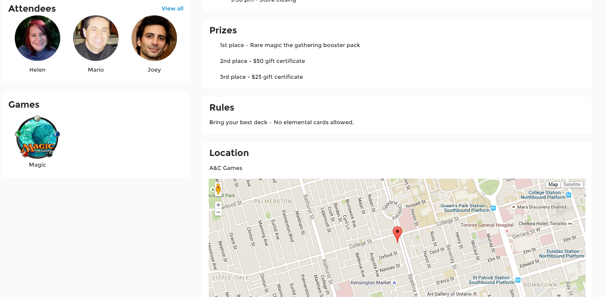

## GameUp!
GameUp! is an online ticketing & event-promotion platform catered towards board & card games.
Think of it as EventBrite for gaming!

### Who is it for?
GameUp! connects social gamers to game organizers ie. local game stores.  
For gamers, it allows them to discover new events, buy tickets online and enroll in tournaments online.  
For event organizers, it simplifies creating tournament brackets, provides an online ticketing system and gives them platform to promote their events to a niche market.

### How is different from EventBrite
EventBrite does not cater towards gaming events. GameUp fills this niche gap. 
Also, GameUp allows for online creating & management of tournament brackets

### Architecture
The major technologies used in this project are:
* Parse (NoSQL database)
* AngularJS (front-end)
* Stripe (online payment)

### Demo
[Live Demo](http://gameup.github.io/#/)

   

   

   

