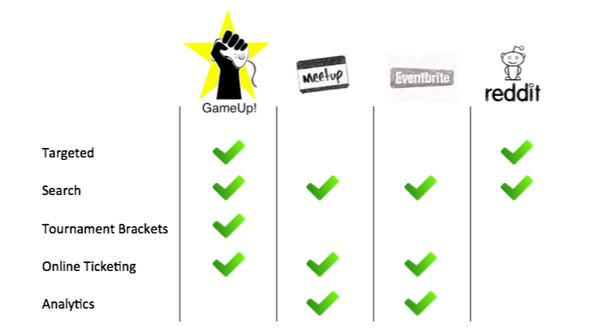

## GameUp!
GameUp! is an online ticketing & event-promotion platform catered towards board & card games.

This project was built using:
* Parse (NoSQL database)
* AngularJS (front-end)
* Stripe (online payment)
* Javascript

### Demo
[Live Demo](http://gameup.github.io/#/)

* Landing page
   

* Event page
   

* Tournament brackets
   

### What can it do?
* Create/manage game events
* Buy/sell online tickets to game events
* Create/manage tournament brackets online

### Who is it for?
For gamers who play card & board games socially.

  
### Competition

