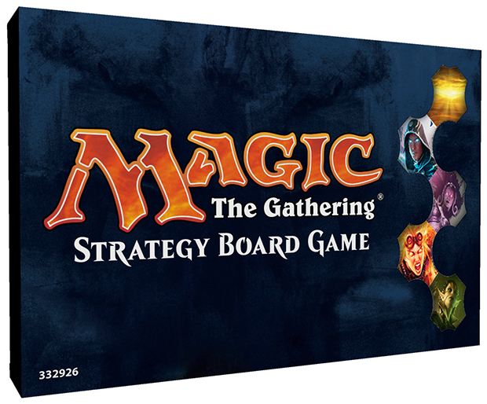

# GameUp
GameUp is an online ticketing & event-promotion platform for board & card games. GameUp allows you to:
* Create gaming events online
* Buy & sell tickets
* Manage tournament brackets

### Technology Stack
* Parse.com (NoSQL database)
* AngularJS (front-end)
* Stripe (online payment)
* Javascript

### Pitch Deck
Our pitch deck can be seen [online](https://dl.dropboxusercontent.com/u/111181899/pitch_deck.pdf)

### Demo
[~~Live Demo~~]()

*Note: Parse.com was acquired by Facebook and shutdown in 2015. As such, the demo will no longer work.*

### Screenshots
* Landing page

* Event page

* Tournament brackets

### Target Audience
GameUp is for gamers who play card & board games socially.

### Competitors

### Competitive Analysis

